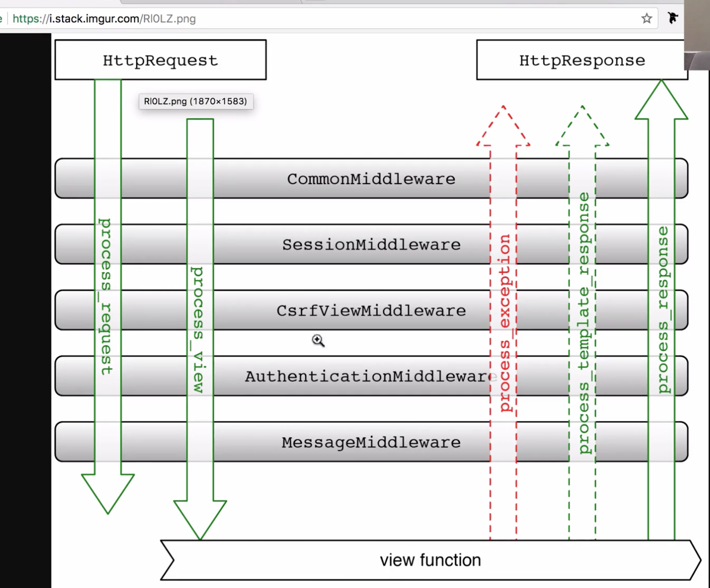

# GUIEENSTA PROJECT_JS_VER

## 1-4
```
pipenv --three
pipenv install django
pipenv shell
exit
```


## 1-5 Parts of Django- Settings, Urls, Apps

* Settings
* Urls
* Apps
  * Products
  * Users
  * Cart
  * Payments


## #1-6. Creating our Django Project

```
pipenv install cookiecutter
pipenv shell
cookiecutter https://github.com/pydanny/cookiecutter-django
```


```
django startproject
로 프로젝트 실행해도 되지만, 좀 여러 설정이 귀찮아짐
따라서 쿠키커터를 이용
```


## #1-7. Creating the GitHub Repository

```
git init
git remote add origin {YOUR_GIHTUB_URL}
git pull origin master
git add .
git commit -m "First commmit"
git push origin master
```

## #1-8. Installing the requirements

```
pipenv --three
pipenv shell
pipenv install -r requirements/local.txt

# In case of an error try this:
pip install -U setuptools
pip install -U pip
pipenv install -r requirements/local.txt
```

## #1-9. Production settings and local settings

```
Production Settings:
Settings that are gonna be loaded on the live server

Local Settings:
Settings that are gonna be loaded on the local server
```

##  #1-11. Creating the Databases
```
CREATE DATABASE guieensta;
python manage.py runserver 
```

## #1-12. Creating the Apps


```
cd nomadgram
django-admin startapp **images**
```

## #1-17. Migrating
```
python manage.py makemigrations
python manage.py migrate
```

##  #1-18. Creating a super user
```
python manage.py createsuperuser

admin // admin12345
```

## #1-29 Django Rest Framework Installation and Basic Concepts

[Home - Django REST framework](http://www.django-rest-framework.org/)
`pipenv install djangorestframework`
🚧 DJANGO 2.0 UPDATE 🚧

Now because of Django 2.0 you need to an app name to the urls you create inside of apps so for example:

```
from django.conf.urls import url
from . import views
app_name = "images" <------ NEW
urlpatterns = [
    url(
        regex=r'^all/$',
        view=views.ListAllImages.as_view(),
        name='all_images'
    )
]

```

##  #1-37 The Request Object in Django




## 


