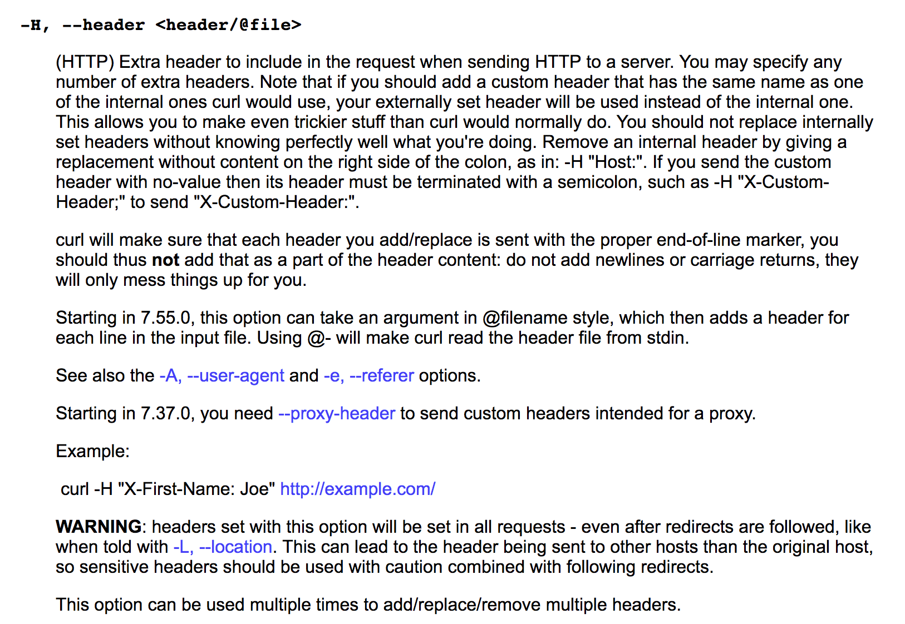
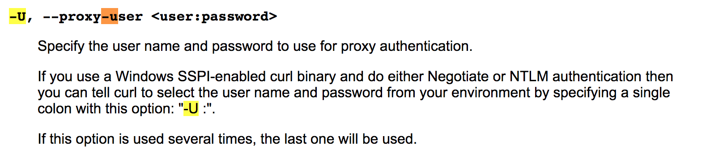
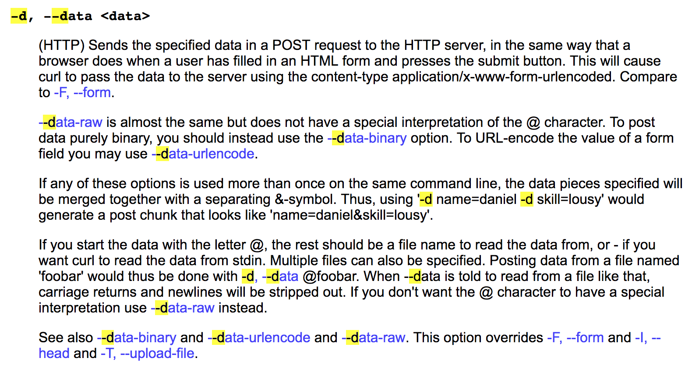

# Studying Curl

- Reference_site :: 
  - https://curl.haxx.se/docs/manpage.html
  - 

---

---

Specify the user name and password to use for proxy authentication.

If you use a Windows SSPI( [컴퓨터/통신]보안 지원 제공자 인터페이스(Security Support Provider Interface) )-enabled curl binary and do either Negotiate or NTLM authentication then you can tell curl to select the user name and password from your environment by specifying a single colon with this option: "-U :".

If this option is used several times, the last one will be used.

---

(HTTP) Sends the specified data in a POST request to the HTTP server, in the same way that a browser does when a user has filled in an HTML form and presses the submit button. This will cause curl to pass the data to the server using the content-type application/x-www-form-urlencoded. Compare to -F, --form.

--data-raw is almost the same but does not have a special interpretation of the @ character. To post data purely binary, you should instead use the --data-binary option. To URL-encode the value of a form field you may use --data-urlencode.

If any of these options is used more than once on the same command line, the data pieces specified will be merged together with a separating &-symbol. Thus, using '-d name=daniel -d skill=lousy' would generate a post chunk that looks like 'name=daniel&skill=lousy'.

If you start the data with the letter @, the rest should be a file name to read the data from, or - if you want curl to read the data from stdin. Multiple files can also be specified. Posting data from a file named 'foobar' would thus be done with -d, --data @foobar. When --data is told to read from a file like that, carriage returns and newlines will be stripped out. If you don't want the @ character to have a special interpretation use --data-raw instead.

See also --data-binary and --data-urlencode and --data-raw. This option overrides -F, --form and -I, --head and -T, --upload-file.

---